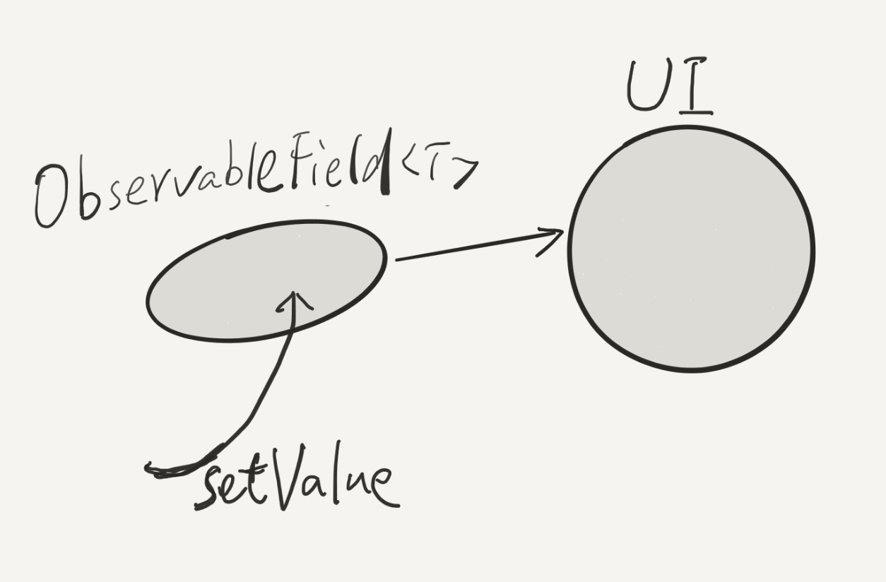
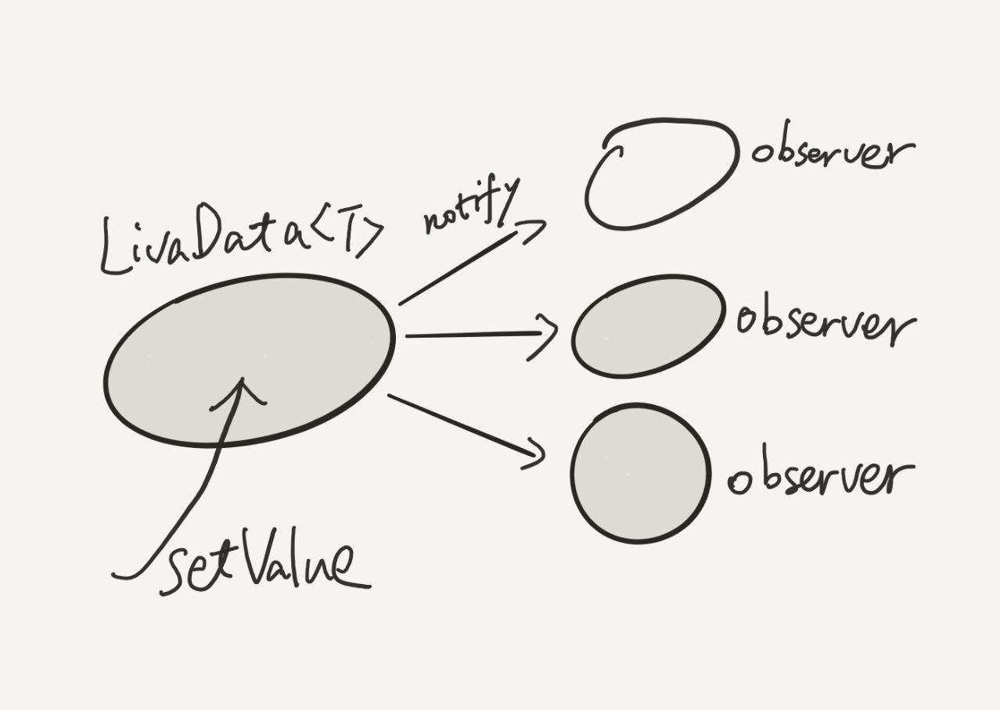

<!-- $theme: default -->

# Android Architecture Components

baurine@2017/8/4

the slides are generated by [Marp](https://github.com/yhatt/marp)

---

# Android Architecture Components

Introduced in Google I/O 2017, still beta

- [Official Docus](https://developer.android.com/topic/libraries/architecture/index.html)
- [Overview Vidoe](https://www.youtube.com/watch?v=vOJCrbr144o)

---

# Android Architecture Components

- Lifecycle Aware Components
- LiveData
- ViewModel
- Room

---

# Room

what's it? kinda of ORM.

in rails, we have powerful ActiveRecord, we super love it!

it escapes us from writing raw SQL at most time.

but in android, we only have low level SQLiteOpenHelper.

painful and not cool!

---

# Some Third Parties Help us

- Realm
- GreenDAO
- LitePal
- ...

---

### SQLiteOpenHelper

    DatabaseHelper dbHelper =
      new DatabaseHelper(SQLiteActivity.this, "test_db", 2);

    SQLiteDatabase sqliteDatabase =
      dbHelper.getWritableDatabase();

    ContentValues values = new ContentValues();
    values.put("name", "zhangsan");

    sqliteDatabase.update("user", values,
                          "id=?", new String[] { "1" });

Terrible!

Can we easily use **`update(user)`** ?

---

## Room

- Entity --> A Table Record, define a table
- DAO: Data Access Object, Operate the tables (CRUD)
- Database (should singleton)

---

# Room

- [Sample Code 1](https://developer.android.com/topic/libraries/architecture/room.html)

- Sample Code 2 (Demo Project)

- Demo

---

# LiveData

Problem: After add record to database, we need to manually re-fetch the data from database and refresh the UI. can we make it smarter?

Let's recall Databinding, we introduce a kind of object called **`ObservableField<T>`**, it wraps an plain data. when we **`setValue(T)`** to it, it will auto update the UI linked with it.

---

### `ObservableField<T>`

---

### `LiveData<T>`

Nearly same with ObservableField

---

## LiveData

- Demo 1 - A Simple Sample
- Demo 2 - Connect with Room, Room can return LiveData!

---

# LifecycleOwner & LifecycleObserver

`liveData.observer( LifeclcyeOwner, oberver )`

so, what's LifecycleOwner?

LifecycleActivity is an instance of LifecycleOwner.

---

## Traditional Activity

    class MainActivity {
      onCreate() {
        ...
        musicPlayer.init();
        timer.reset();
      }
      onStart() {
        ...
        musciPlayer.start();
        timer.start();
      }
      onStop() {
        ...
        musicPlayer.stop();
        timer.stop();
      }
      ...

---

## Traditional Activity

1. Likes your mom, directly commands you to do what. 6:00, get up!, 7:00, have breakfast!, 8:00, be quick to go to school, then you will be late! 22:00, go sleep!
2. Activity is active, musicPlayer, timer is passive.

Then, imaging in school, when 8:00, does the scholl directly tell everybody to do what? does it tell LiLei to go to room No.1 to listen class, does it will tell Miss Li to go to room No.2 to teach English.

No, it just ring, ring, ring. then every body knows what they should do, and they do it by themself.

---

## LifecycleActivity

    class LifecycleActivity implements LifecycleOwner {
      onCreate() {
        ...
        notify(ON_CREATE);
      }
      onStart() {
        ...
        notify(ON_START);
      }
      onStop() {
        ...
        notify(ON_STOP);
      }
      ...

---

## LifecycleActivity

    public class MusicPlayer implements LifecycleObserver {

        @OnLifecycleEvent(Lifecycle.Event.ON_START)
        public void onStart() {
          // do some preparation
        }

        @OnLifecycleEvent(Lifecycle.Event.ON_PAUSE)
        public void onPause() {
          // pause play
        }
    }

    getLifecycle().addObserver(new MusicPlayer());

- Demo

---

# ViewModel

Considering rotate the screen, the activity will be destroyed and re-created. All of the data store in the activity will released and need to re-fetch! It should be unncessary.

Sometimes the activity be destroyed abnormally by system.

ViewModel is a data container. it has longer lifecycle than Activity. Only when Activity finish normally, the ViewModel will be released, else, it will always in the memory!

So, you should always store the data in the ViewModel, instead of directly put it in Activity.

---

# ViewModel

Likes Activity, you can't **`new`** a ViewModel, it is created and managed by framework.

    DateViewModel dateViewModel =
      ViewModelProviders.of(this).get(DateViewModel.class);

- Demo - Compare the ViewModel and store data in Activity

---

## Final An App Architecture

---

# What's Repository

Think about this. We go to market shopping. kinds of goods in the market, come from many many different countries, maybe by train, maybe by air, by boat. anyway, do we care about how they come, how hard they experience in their trip, even where they come from. Nope!

**the market hide these details for us customers.**

So in the app, the data likes goods, and UI likes the customers, they consume data. And, the repository likes the market, they handle kinds of data from different source (database, webservice), and supply a simple interface for UI.

---

# Q & A

Thanks!
