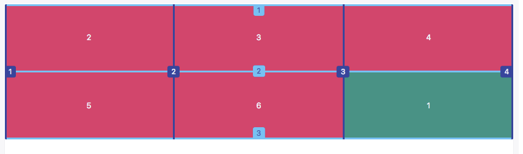

# CSS Grid

Simple introduction for CSS Grid

baurine@2017/12/15

the slides are generated by [Marp](https://github.com/yhatt/marp)

---

## Android Layouts

- LinearLayout
- RelativeLayout
- FrameLayout
- ...

---

## Traditional Web Layout

- Block element: `
` `<h1>` `
` `<ul>` ...
- Inline element: `` `<a>` ``

Block element takes a whole row space while inline element doesn't, it places after another inline element in the same row.

In traditional layout, sometimes we can't easily place an element in the center of its parent.

Demo: <https://jsfiddle.net/57zn8jqf/>

---

## FlexBox

    .container {
      display: flex;
    }

In FlexBox, there are no block elements and inline elements any more, they are nearly the same.

They are all arranged in a same row or in a same column, depending the container `flex-direction` property.

Demo:

- <https://jsfiddle.net/57zn8jqf/2/>
- <https://jsfiddle.net/57zn8jqf/1/>

---

## CSS Grid

Traditional Layout / FlexBox, one dimension layout.

CSS Grid, 2 dimensions layout, support multiple rows and columns.

- rows / columns
- item position
- align items

---

## Rows / Columns

    .container {
      display: grid;
    }

- grid-template-columns
- grid-template-rows
- grid-column-gap
- grid-row-gap

Demo:

- <https://jsfiddle.net/57zn8jqf/4/>
- <https://jsfiddle.net/57zn8jqf/5/>
- <https://jsfiddle.net/57zn8jqf/6/>

---

## Item Position

---

## Item Position

Put "A" item to bottom right corner:

    .item-a {
      ...
      grid-row-start: 2;
      grid-row-end: 3;
      grid-column-start: 3;
      grid-column-end: 4;
    }

Demo:

- <https://jsfiddle.net/57zn8jqf/7/>
- <https://jsfiddle.net/57zn8jqf/8/>
- <https://jsfiddle.net/57zn8jqf/9/>

---

## Item Position

Support put different items in the same area:

    .item-a, .item-b {
      ...
      grid-area: 2/3/3/4;
    }

Demo: <https://jsfiddle.net/57zn8jqf/10/>

---

## Item Position

Supports one item take multiple areas space:

    .item-d {
      grid-area: 1/2/2/4;
    }
    .item-e {
      grid-area: 1/1/3/2;
    }

Demo: <https://jsfiddle.net/57zn8jqf/12/>

---

## Align Items

- For container: `justify-items`, `align-items`
- For child item: `justify-self`, `align-self`

Center item "C":

    .item-c {
      justify-self: center;
      align-self: center;
    }

Demo:

- <https://jsfiddle.net/57zn8jqf/13/>
- <https://jsfiddle.net/57zn8jqf/14/>

---

## Thanks & QA
