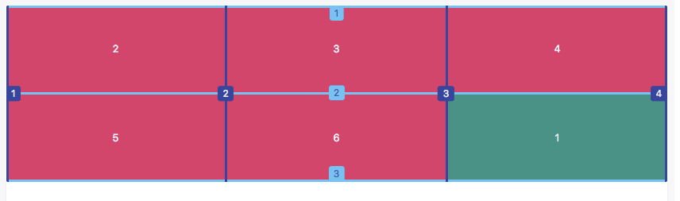

# CF - CSS Grid Simple Introduction

## 1 - Cover Page

Today I will do a simple introduction about CSS Grid, a kind of new web layout technology after FlexBox. We won't dive into it, just demo some most useful features, because it doesn't get popular yet, and only be supported by a few browsers.

## 2 - Android Layouts

In Android, we have many layouts to choose, likes LinearLayout, RelativeLayout, FrameLayout. We can use different layout under different situation, it brings us much conveniences.

## 3 - Traditional Web Layout

But in web, for a long time, there is only one kind of layout, we can call it traditional layout. In this kind layout, there are 2 types of elements:

- Block element - div, p, h1...h6, table, ul, li ...
- Inline element - span, a, img ...

Block element takes a whole row space, all block elements start from a new row.

While inline element doesn't take a whole row space, it places after another inline element in the same row.

Let's see their difference. We place 5 children items in a container, some of them are block elements, some of them are inline elements. We add some border and color for them.

    

      

        A
      

      

        B
      

      C
      D
      

        E
      

    

    .container {
      border: 4px solid red;
      padding: 10px;
    }

    .item {
      border: 4px solid blue;
      padding: 10px;
      background-color: #f39;
      font-size: 40px;
      color: white;
      font-family: Helvetica;
    }

Demo: <https://jsfiddle.net/57zn8jqf/>

Now, you see, the block element takes the whole row space, but inline element doesn't.

In traditional layout, sometimes we can't easily place an element in the center of its parent. For example, we want to center the letter "A" in its box.

How can we do it? we can try this.

    .item-a {
      text-align: center;
      height: 100px;
    }

But unfortunately, we only can center it horizontally.

## 4 - FlexBox

Then, we have FlexBox.

    .container {
      display: flex;
    }

In FlexBox, there are no block elements and inline elements any more, they are nearly the same.

They are all arranged in a same row or in a same column, depending the container `flex-direction` property.

Let see how it works, we try to set `flex-direction` to `row` or `column`.

    .container {
      border: 4px solid red;
      padding: 10px;

      display: flex;
      flex-direction: column;
    }

Demo: <https://jsfiddle.net/57zn8jqf/2/>

In FlexBox, it is very easy to center an element. For example, here, we also want to center the letter "A" in its box.

    .item-a {
      display: flex;
      justify-content: center;
      align-items: center;
      height: 100px;
    }

We change item "A" display to flex, and set `justify-content` property to `center`, and `align-items` property to `center`. See, it works, and has no tricky.

Demo: <https://jsfiddle.net/57zn8jqf/1/>

## 5 - CSS Grid

No matter traditional layout or FlexBox, they only arrange children items in one dimension, row or column. we ever have `table` element can arrange items in 2 dimensions, but it is better to use it just to display data, not layout.

CSS Grid, just as its name, it is a 2 dimensions layout. It can arrange items in grids, so it means multiple rows and columns.

We will talk about 3 parts of content about it.

- rows / columns
- item position
- align items

## 6 - Rows / Columns

Let see how it display multiple rows and columns, at first, we need to change the container display to `grid`.

    .container {
      display: grid;
    }

Demo: <https://jsfiddle.net/57zn8jqf/4/>

It seems no changes, because the grid layout default behavior is just 1 column, and many rows.

Then we use `grid-template-columns` property to separate a container into many columns, here we demo 3 columns, and we can assign each column with different width by a fixed value or a relative value. For example, we set the first column to 100px, and remain 2 columns take all the remain width, and we set the third column width is 2 times of the second column width, here we use `fr` as measurement unit.

    grid-template-columns: 100px 1fr 2fr;

We add some gap between columns by `grid-column-gap` property.

    grid-column-gap: 10px;

Demo: <https://jsfiddle.net/57zn8jqf/5/>

We use `grid-template-rows` property to set height for different rows, we set the first row height is 100px, while the second row height is 200px.

    grid-template-rows: 100px 200px;

We also add some gap between rows by `grid-row-gap` property.

    grid-row-gap: 10px;

Now, it looks like this. Is it magic?

Demo: <https://jsfiddle.net/57zn8jqf/6/>

## 7 - Item Position

By default, the children items place orderly, but it also supports change their position. For example I want place item "A" in the bottom right corner. How can I do it?

Likes in the class room, every seat has a number, I can say I sit in Row 2nd, Column 3rd, so people can easily find me by my seat number.

The CSS Grid also numbered its children items, but it is a little different, it numbers the grid border, not grid self.

**One picture is worth thousand words**

For example, in this layout, there are 2 rows, 3 columns, they are surrounded by 3 horizontal borders and 4 vertical borders.

So the first area is from row 1 to 2, column 1 to 2, the last area is from row 2 to 3, column 3 to 4, right?

So if we want to put "A" item to bottom right corner, we assign its position to last area, we use `grid-row-start` `grid-row-end` `grid-column-start` `grid-column-end` properties to define an item area.

    .item-a {
      ...
      grid-row-start: 2;
      grid-row-end: 3;
      grid-column-start: 3;
      grid-column-end: 4;
    }

Demo: <https://jsfiddle.net/57zn8jqf/7/>

The above written can be simplified by `grid-row` and `grid-column` properties.

    grid-row: 2/3;
    grid-column: 3/4;

Demo: <https://jsfiddle.net/57zn8jqf/8/>

And we can continue to simplify the written by `grid-area` property.

    grid-area: 2/3/3/4;

`grid-aera` combines the `grid-row-start`, `grid-column-start`, `grid-row-end`, `grid-column-end` properties.

Demo: <https://jsfiddle.net/57zn8jqf/9/>

It also supports put different items in the same area. For example, here we also put item "B" in the last area.

    .item-a, .item-b {
      ...
      grid-area: 2/3/3/4;
    }

Demo: <https://jsfiddle.net/57zn8jqf/10/>

Now the item "A" is covered by item "B", we can use `z-index` property to make item "A" show above item "B".

    .item-a {
      z-index: 1;
    }

Demo: <https://jsfiddle.net/57zn8jqf/11/>

CSS Grid also supports one item take multiple areas space. For example, we want to make item "D" cover 2 columns.

    .item-d {
      grid-area: 1/2/2/4;
    }

We want to make item "E" cover 2 rows.

    .item-e {
      grid-area: 1/1/3/2;
    }

Demo: <https://jsfiddle.net/57zn8jqf/12/>

## 8 - Align Items

- For container: `justify-items`, `align-items`
- For child item: `justify-self`, `align-self`

(Similar with FlexBox properties.)

By default, the child item will fill the whole space of the area, their width and height are equal to the area width and height. We can change its default behavior. For example, the item "C", currently it covers the whole area. We want to place the item "C" in the center of this area, and its width and height depend on its content.

Because it changes the child element self, not container, so we use `justify-self` and `align-self` properties.

    .item-c {
      justify-self: center;
      align-self: center;
    }

Demo: <https://jsfiddle.net/57zn8jqf/13/>

We also can try arrange it align left, right, top, bottom, just try it. (use "start" "end" "stretch" value)

If we want align all items in the center of its area, we change setting in container by `justify-items` `align-items` properties.

    .container {
      justify-items: center;
      align-items: center;
    }

Demo: <https://jsfiddle.net/57zn8jqf/14/>

Put item "A" in the center of its area: <https://jsfiddle.net/57zn8jqf/15/>

## 9 - Thanks & QA

That's all I want to talk about today, it is just a few about CSS Grid, you can learn it deeper if you are interested in it.
