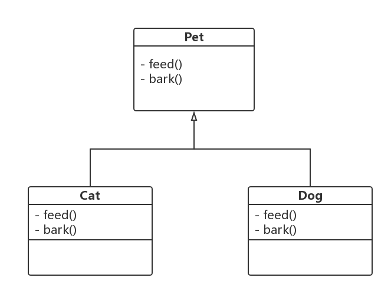
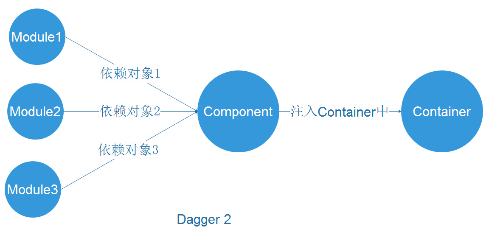

<!-- $theme: default -->

# Dependency Injection & Dagger2


baurine@2017/5/5

the slides are generated by [Marp](https://github.com/yhatt/marp)

---

# Dependecy Injection

> ## A programing thinking, design pattern

# Dagger2

> ## A tool help to implement the DI

---

# Start From Unit Test

---

```java
public class LoginPresenter {

  private UserManager mUserManager = new UserManager();

  public void login(String username, String password) {
    if (username == null || username.length() == 0) return;
    if (password == null || password.length() < 6) return;

    mUserManager.performLogin(username, password);
  }

}
```

---

```java
public class LoginPresenterTest {

  @Test
  public void testLogin() throws Exception {
    LoginPresenter loginPresenter = new LoginPresenter();
    loginPresenter.login("ekohe", "ekohe password");

    // verify the mUserManager in LoginPresenter will
    // call performLogin() method,
    // and parameters should be "ekohe" and
    // "ekohe password"
    ...
  }

}
```

---

```java
public class LoginPresenter {

  private UserManager mUserManager = new UserManager();

  public void login(String username, String password) {
    if (username == null || username.length() == 0) return;
    if (password == null || password.length() < 6) return;

    mUserManager.performLogin(username, password);
  }

  public void setUserManager(UserManager userManager) { //<==
    this.mUserManager = userManager;
  }

}
```

---

```java
@Test
public void testLogin() throws Exception {
  UserManager mockUserManager = Mockito.mock(UserManager.class);

  LoginPresenter loginPresenter = new LoginPresenter();
  loginPresenter.setUserManager(mockUserManager);  //<==

  loginPresenter.login("ekohe", "ekohe password");

  Mockito.verify(mockUserManager)
         .performLogin("ekohe", "ekohe password");
}
```

---



---

```java
public class PetLover {
    private Pet pet = new Cat("XiaoHua");  //<===

    public void feed() {
      pet.feed();
    }

    public void play() {
      pet.bark();
    }
}
```

---

```java
public class PetLover {
    private final Pet pet;  //<===

    public PetLover(Pet pet) {
      this.pet = pet;
    }

    public void feed() {
      pet.feed();
    }

    public void play() {
      pet.bark();
    }
}
```
---

# 3 ways to implement DI

- ## setter injection
- ## constructor injection
- ## argument injection

```java
public class LoginPresenter {
  public void login(UserManager userManager,
                    String username, String password) {
    //... some other code
    userManager.performLogin(username, password);
  }
}
```

---

# DI brings us

- ## Convenient to test
- ## Decoupling
- ## IoC (Inversion of Control)

---

# So, What's Dagger2?
# Why we still need it?

---

```java
public class LoginActivity extends AppCompatActivity {
  private LoginPresenter mLoginPresenter;

  @Override
  protected void onCreate(Bundle savedInstanceState) {
    super.onCreate(savedInstanceState);
    setContentView(R.layout.activity_main);

    OkHttpClient okhttpClient = new OkHttpClient.Builder()
            .connectTimeout(30, TimeUnit.SECONDS)
            .build();
    Retrofit retrofit = new Retrofit.Builder()
            .client(okhttpClient)
            .baseUrl("https://api.github.com")
            .build();
```

---

```java
    UserApiService userApiService
      = retrofit.create(UserApiService.class);
    SharedPreferences preferences
      = PreferenceManager.getDefaultSharedPreferences(this);
    UserManager userManager
      = new UserManager(preferences, userApiService);

    PasswordValidator passwordValidator
      = new PasswordValidator();
    mLoginPresenter
      = new LoginPresenter(userManager, passwordValidator);
  }
}
```

---

Dagger2!


---

# Core Concepts

- ## Module : Factory to provide dependency
- ## Component : Injector
- ## Container : Injection target

---




---

```java
@Module
public class AppModule {
  @Provides
  public OkHttpClient provideOkHttpClient() {
    OkHttpClient okhttpClient = new OkHttpClient.Builder()
            .connectTimeout(30, TimeUnit.SECONDS)
            .build();
    return okhttpClient;
  }

  @Provides
  public Retrofit provideRetrofit(OkHttpClient okhttpClient) {
    Retrofit retrofit = new Retrofit.Builder()
            .client(okhttpClient)
            .baseUrl("https://api.github.com")
            .build();
    return retrofit;
  }
```

---

```java
  @Provides
  public UserApiService provideUserApiService(Retrofit retrofit) {
    return retrofit.create(UserApiService.class);
  }

  @Provides
  public SharedPreferences provideSharedPreferences(Context context) {
    return PreferenceManager.getDefaultSharedPreferences(context);
  }

  @Provides
  public UserManager provideUserManager(
    SharedPreferences preferences,
    UserApiService service) {
    return new UserManager(preferences, service);
  }
```

---

```java
  @Provides
  public PasswordValidator providePasswordValidator() {
    return new PasswordValidator();
  }

  @Provides
  public LoginPresenter provideLoginPresenter(
    UserManager userManager,
    PasswordValidator validator) {
    return new LoginPresenter(userManager, validator);
  }

   @Provides
  public Context provideContext() {
      return MyApplication.getContext();
  }
}
```

---

# Component

```java
@Component(modules = {AppModule.class})
public interface AppComponent {
    void inject(LoginActivity loginActivity);  //<==
}
```

---

# Container

```java
public class LoginActivity extends AppCompatActivity {
  @Inject // <===
  LoginPresenter mLoginPresenter;

  @Override
  protected void onCreate(Bundle savedInstanceState) {
    super.onCreate(savedInstanceState);
    setContentView(R.layout.activity_main);

    DaggerAppComponent.create().inject(this); //<=====

    // then, mLoginPresenter is instanced
    mLoginPresenter.login("ekohe", "ekohe password");
  }
}
```

---

# More about Dagger2

- ## @Named
- ## @Scope @Singleton
- ## @SubComponent
- ## ...

---

# Thank You & QA
