# How HTTPS Protoect our Secrets

baurine@2018/01/19

the slides are generated by [Marp](https://github.com/yhatt/marp)

---

## HTTPS - S means

More and more websites change protocl from http to https, why?

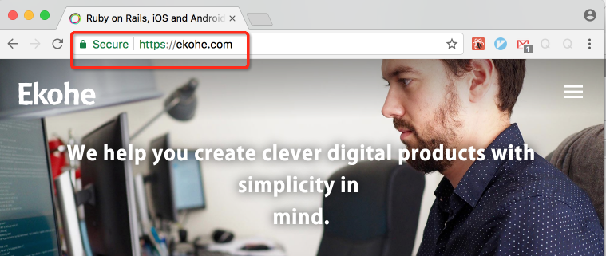

HTTPS - HTTP **Secure**

---

## Why http doesn't safe

Http is a **plain text** protocol.

- Plain Text: "Today is Friday"
- Non-Plain Text: "U2FsdGVkX1/3q8GKjfbXf7Kp0Di96LLW2LUZHcX3H2U="

---

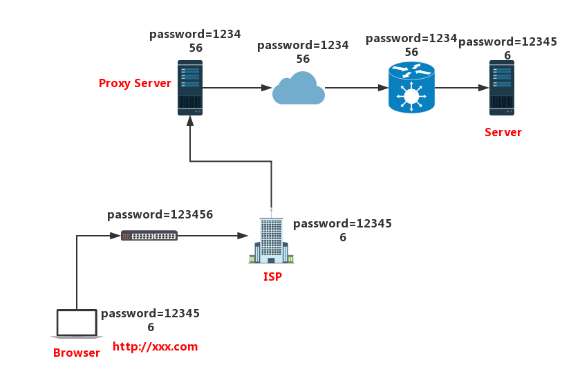

---

## Http Hijack

---

## Solution

Encrypt data.

### Encryption Algorithm

- have key
- can transfer it back by key

so Base64 / MD5 are not encryption algorithm.

- Symmetric Encrpytion: DES / AES ..., fast
- Asymmetric Encrpytion: RSA / ECC ..., slow

[Online tool](http://tool.oschina.net/encrypt)

---

## Asymmetric Encrpytion

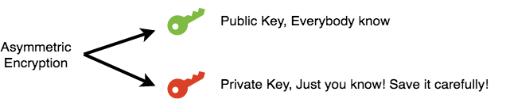

---

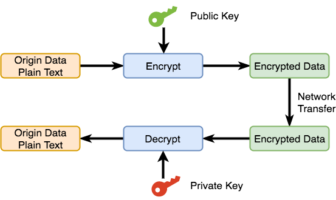

---

## First try - Symmetric Encrpytion

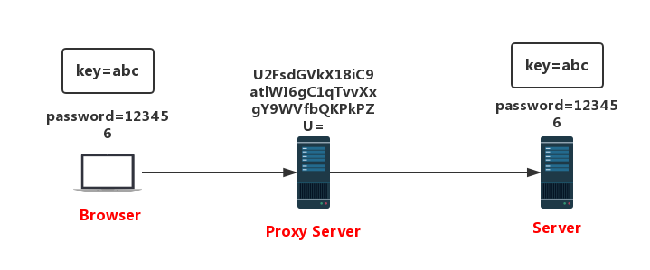

Problem: who generate the key, who hold it? how transmit it to another side?

---

## Try Asymmetric Encrpytion

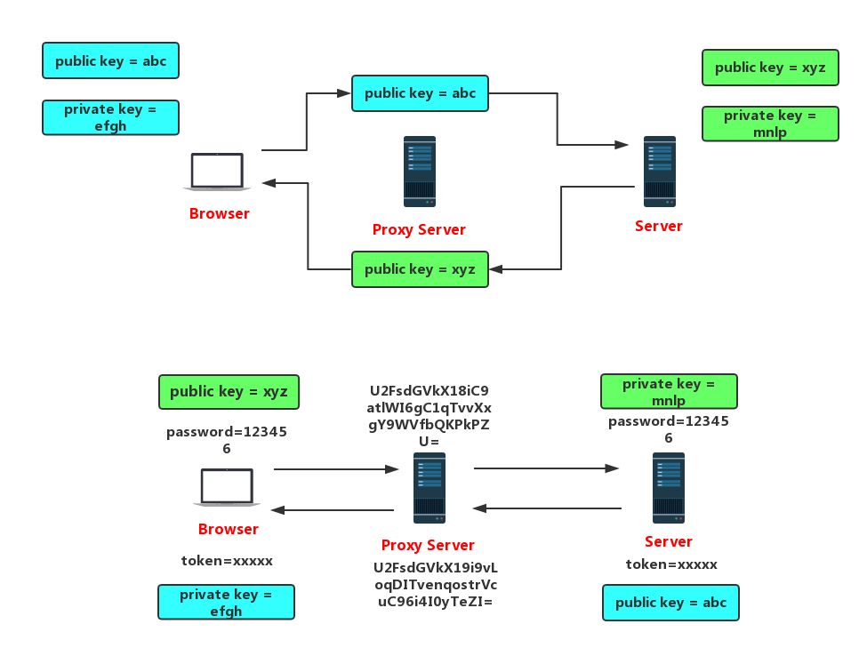

---

Asymmetric Encryption Problem:

- Too Slow!

Can we combine the Symmetric and Asymmetric together?

---

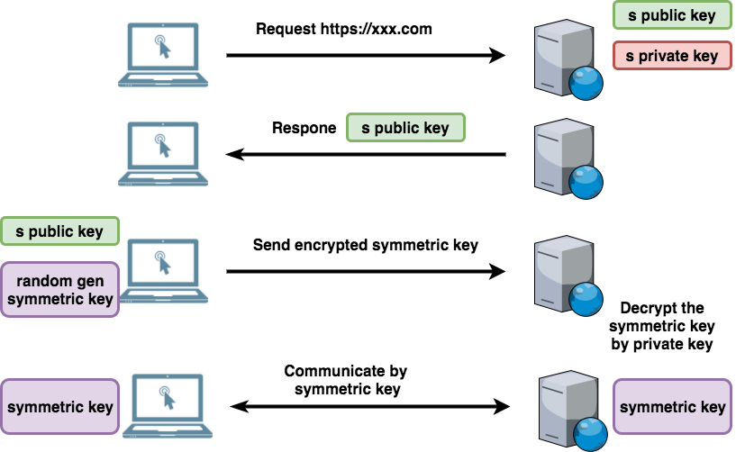

---

## Man-in-the-middle Attack

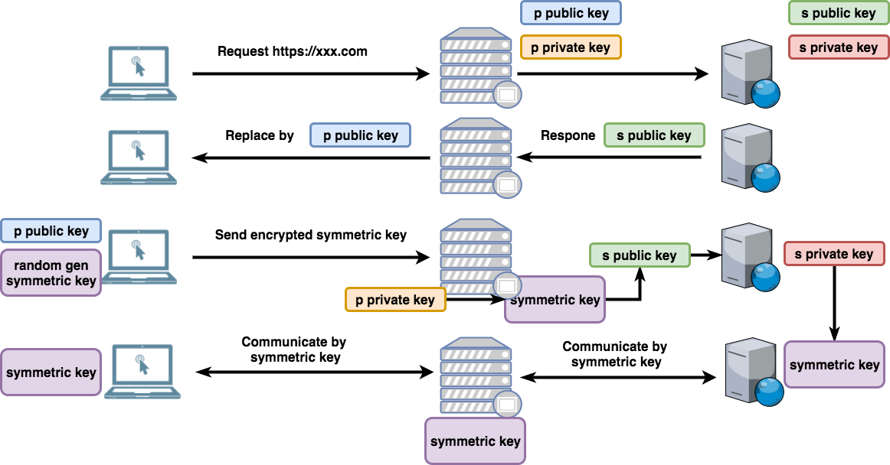

---

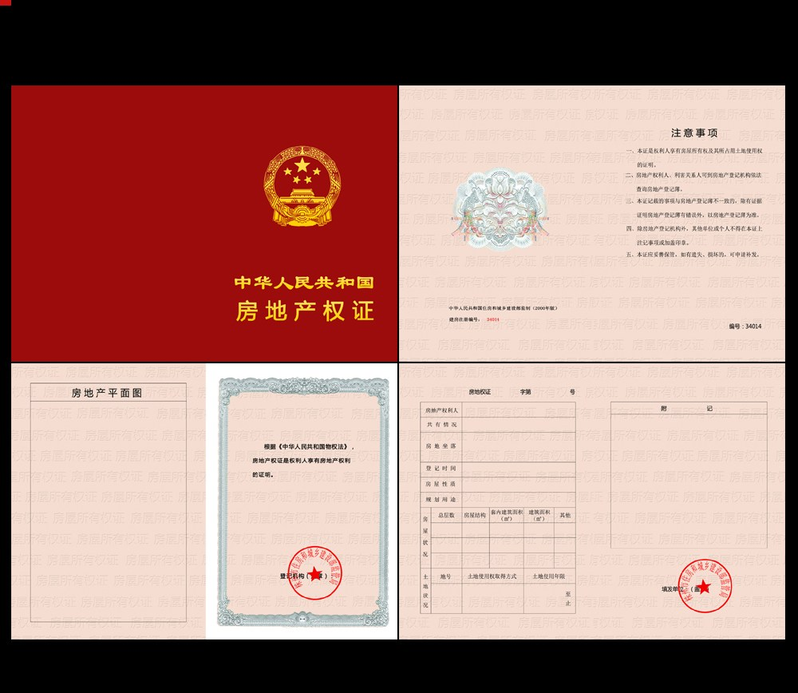

---

## CA - Certificate Authority

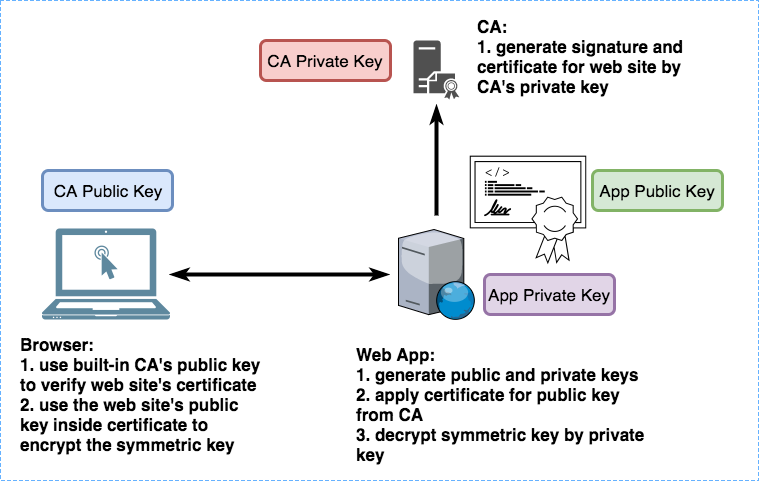

---

## How CA generate digital certificate?

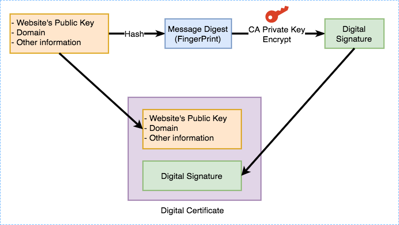

---

## How client verify certificate?

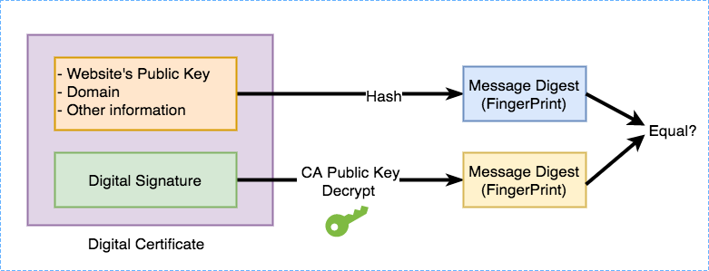

---

## Verify failed

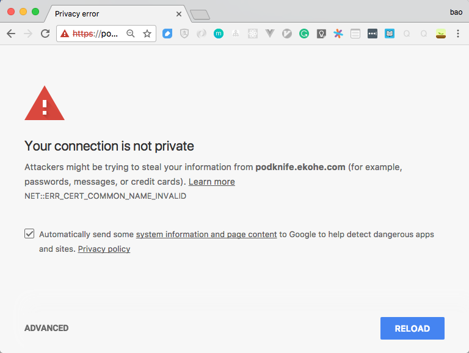

---

## Whole flow

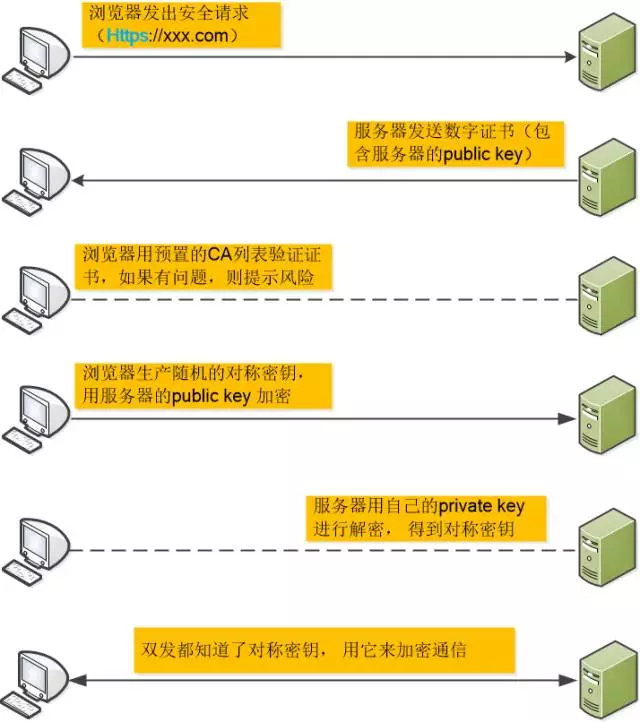

---

## One More Thing - Code Signature

---

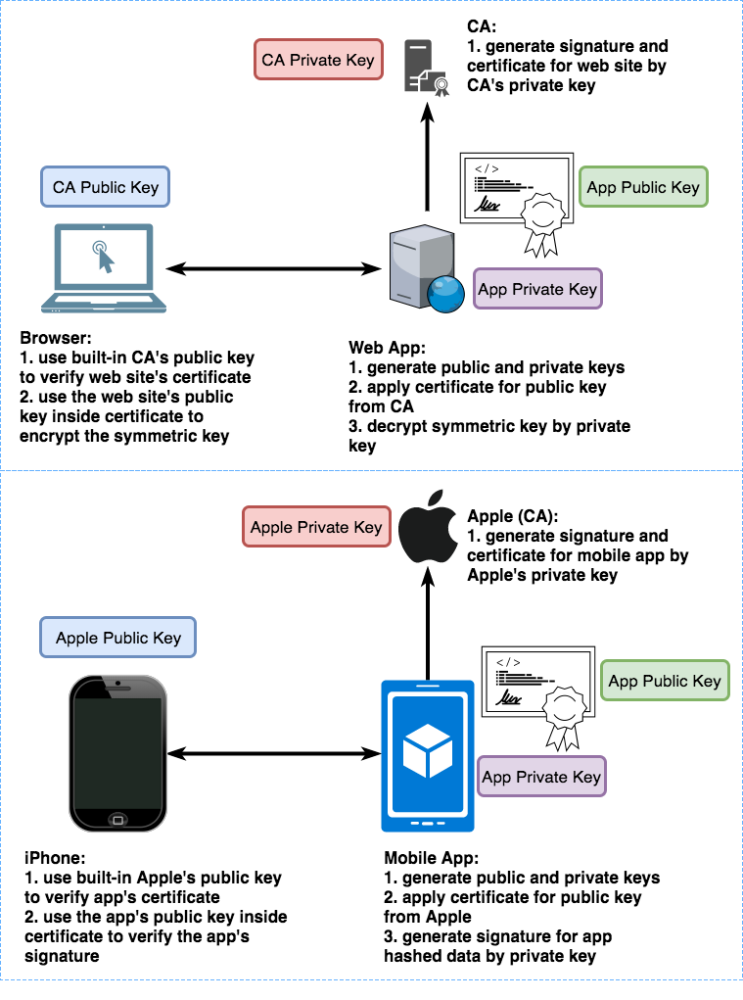

---

---

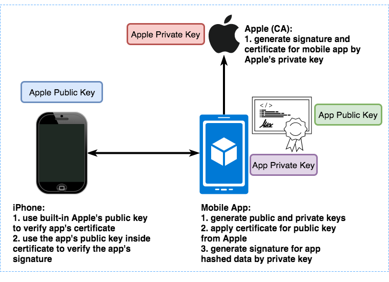

---

## iOS Code Signature

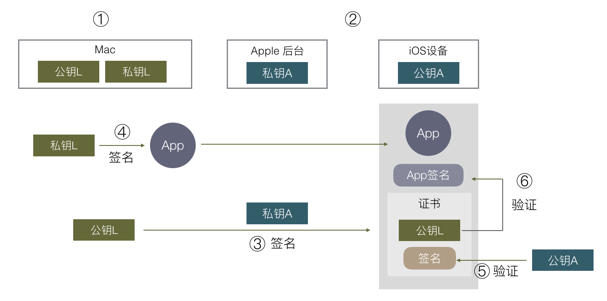

---

## Android Code Signature

**No CA Role**

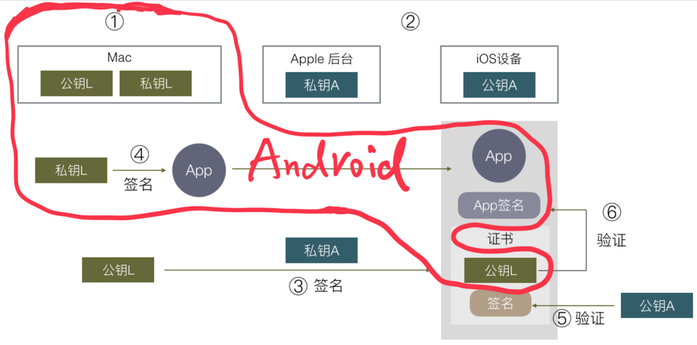

---

## References

- [一个故事讲完 https](https://mp.weixin.qq.com/s?__biz=MzAxOTc0NzExNg==&mid=2665513779&idx=1&sn=a1de58690ad4f95111e013254a026ca2&chksm=80d67b70b7a1f26697fa1626b3e9830dbdf4857d7a9528d22662f2e43af149265c4fd1b60024&scene=21)
- [iOS App 签名的原理](http://blog.cnbang.net/tech/3386/)

Some images used above are copyed from these 2 references.

---

# Thank You & QA
