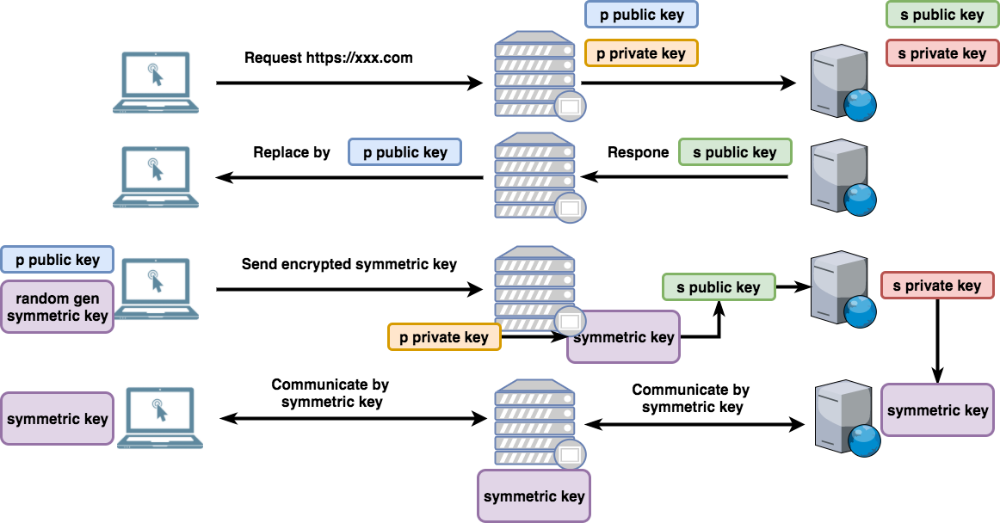
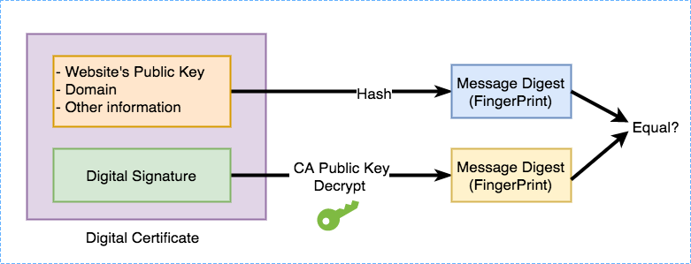
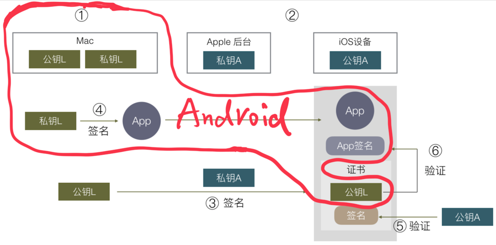

# How Https Protect our Secrets

Hello everybody, today I will talk about "How Https Protect our Secrets".

---

## What's HTTPS

You must realize, more and more websites change protocol from "http" to "https", why?

You maybe say, because Google and Apple force us to use, they will don't allow us to use http one day. The http sites have lower priority in Google search engine, and Chrome browser warn user for http site. The iOS App can't access http content default.

So, why they don't encourage us to use http any more?

Let see what the "s" in "https" means, HTTPS - HTTP Secure. so it means https can bring us safe, while the http can't.

---

## Plain Text

Why http is not safe. The http protocol is a plain text protocol, it means, all the data we communicate with server are plain text.

Here has a very import conception - plain text, what it means? it represents the readable characters. For example, this sentence - "Today is Friday", so very body see these characters, he can understand it, right? so, this is the plain text. and its opposite is encrypted data, we will talk about it later.

- Plain Text: "Today is Friday"
- Non-Plain Text: "U2FsdGVkX1/3q8GKjfbXf7Kp0Di96LLW2LUZHcX3H2U="

---

## Pass Through Many Devices

When we communicate with server, the data will pass through many devices, right? some routers, proxy server, gateway ..., because the data are plain text, so, every device can see the content, include our password, our private message ... there are no privacy at all, it kind likes we run in the street barely, right?

---

## HTTP Hijack

They can see the content, they also can steal the password to do some bad thing, to crime, and even, they can modify the original content, for example, inject some advertisements, or some virus, terrible! Especially the extra advertisement, I believe most of Chinese have met this problem, because it is done by ISP, internet service provider, like China Mobile, China Unicom, and every communication needs pass through ISP. We call this as "Http Hijack".

---

## Solution - Encrypt Data

So, people think, we must resolve this problem, plain text is too dangerous for our important private data.

And the solution is easy, why not we encrypt the data, right? so they can't see the origin data, can't modify it. nice! let's do it!

So, when we talk about encryption, it must be related some encryption algorithm, right?

So, what's encryption algorithm, it can change your original data, plain text to some meaningless, strange characters, numbers by a key. and you also can transfer it back, it is called decrpyt.

So we can see from the definition, there are 2 rules:

1. have key
1. can transfer it back by key

Notice, we usually talk about Base64, MD5, they are not encryption algorithm, because they don't follow these 2 rules. the Base64, it doesn't need key, everybody can transfer it back, Base64 is a kind of encoding algorithm. and MD5, doesn't need key, and when the data change to MD5, it can't transfer back (has posibility, but very very low), it is uni-directional. it is a kind of Hash algorithm.

Come back to see encpytion algorithm, there are 2 kinds:

1. symmetric encryption - AES / DES
1. asymmetric encryption - RSA / ECC ...

The symmetric encryption, it means, we use the same key to encrypt and decrypt, it is easy to understand, it is a common sense, right? we don't talk much about this.

[Online tool](http://tool.oschina.net/encrypt) (demo Base64 and MD5, DES)

---

## Asymmetric Encryption - Pair Keys

but the asymmetric encryption, it is interesting, the key to encrypt and the key to decrypt are different! strange, right? but it is a brilliant invention in 1970s.

in the asymmetric encryption, there are a pair of keys, one is called public key, another one is called private key. you must be familiar with it, because we use it every day, for git, for SSH.

the public key, it can be known by everybody, it doesn't matter, while the private key, it is very important, it can't be known by others, it is only be known by yourself. if you leak your private key, opps, you screw up!

---

## Asymmetric Encryption - 2

If the data is encrypted by public key, only private key can decrypt it, while if the data is encrypted by private key, only public key can decrypt. that's why it is called asymmetric encrpytion.

BTW, the key, in fact they are just some randomly generated characters, numbers, no special meaning.

---

## Try Symmetric

the asymemetric encrpytion is so advantage, but has a fatal drawback, it is too slow, much slower than symmetric encryption, we don't want to slow the communication, right? so we try symmetric encryption first.

The client encrypt the plain data by symmetric key abc, send to server, and the server decrypt it by the same key abc, also encrypt data by the key abc, response to client.

See, it seems the problem is resolved.

But, let's think it more, about the key abc, who generate it or who hold it? how it send to another side, right?

we can't encrypt the key, right? if we encrypt the key, how another side decrpyt it?

and if we send the key by plain text, the old problem comes back, everybody can know this key, the encryption is a Maginot Line, just an ornament.

---

## Try Asymmetric

So, it seems the symmetric encrpytion doens't work for http, we try to consider the asymmetric encryption.

The client and Server both have their own private key and public key, at the first step, they need exchange their public keys. because the public key can be known by every body, so we can exchange them by plain text, right?

After the both side know each other's public key, they can encrypt the data by the other side's public key, and decrypt the received data by itself's private key, right?

it looks perfect! now the data are totally encrpyted, we are safe now!

---

## Asymmetric Problem

but, another problem comes! we have said, the asymmetric encrpytion is very slow, the whole communication is much slower than before, some websites have high requirement for low latency. we cann't afford it.

symmetric is fast, but we can't resolve how to transmit the key, asymmetric is fine but too slow, can we combine them together?

I have a pen, I have an apple, ApplePen!

We really can!

---

## Combine Symmetric and Asymmetric

So the new flow looks like this:

Just the server has a pair of keys, at first the client request the server, the server will response its public key to client, then client will randomly generate a symmetric key, and encrypt it by server's public key, send to server, after server receive it, it can decrpyt it by server's private key, right? now, both sides know the symmetric key, but others don't, right? then we use symmetric encryption to do remain communication.

So we just use asymetric to transmit the symmetric key, then we use symmetric encrpytion to do remain communication.

Now it is really perfect, right?

---

## Man-in-the-middle Attack

But you know, the internet, fill many many frauds, thieves, hackers, they seek the system bugs always and do some attack.

in above system, it seems fine, but has a fatal bug.

consider this situation. the data pass through a proxy server.

when the server response its public key to client, it will reach proxy server first, the proxy server can intercept it, then, replace it by proxy server itself public key, then the client will get proxy server's public key, but does it konw? no, it doesn't konw, it believe its server's public key.

then client will generate the key, encrpyt the key by proxy server's public key, and send to proxy server, proxy server can decrpyt it by itself private key, right? now, he get the key! and he will encrypt it again by server's public key, pretend nothing happened.

then the server will decrypt the key by itself private key.

but now, client, proxy, server, they all know the key, no secret again.

This is called "Man-in-the-middle attack"

---

## CA - 1

So, we must have a way to make sure, the public key client get from server, is the real server's public key, not modified or replaced by someone.

How to do it?

Think about in our real life, how can we prove a house is my house, we have a "Housing Property Ownership Certificate", and it is published by our government - authority, everybody admits it. the certificate records our personal information, our house information.

---

## CA - 2

So, people think, we also can have this kind institution, to endorse these websites' public key. So they created this institution, called CA - Certificate Authority.

The CA also has its own public key and private key. its public key will built-in your browsers or operate system.

every websites need to apply digital certificate from CA, when it applys, it needs to commit some information, materials, right, likes, domain, but the most important information is the website's public key.

---

## How CA generate certificate

Let's see how it the digital certificate generated.

at first, the website's public key and other information will be hashed, then we get its message digest (you can recognize it as a kind of MD5 value), then the CA will encpyt it by CA's private key. yep, CA also has private key and public key. the encrypted data we called "digital signature".

the website's public key, other information, and the digital signature, package together, then we get the digital certificate.

Here why we need hash the origin information, why we don't encrypt it directly, there are 2 reason:

1. the data to be encrypted can't be too large, hash can help reduce the data size to be encrypted, no matter how large original data, we will get 128bit, or 160bit, or 256bit message digest.
1. even you change 1bit of original data, the message digest will be totally different

(demo it)

---

## How client verify certificate

Now the client will request certificate at first, when it get the certificate, it will verify it. the CA's public key will be built-in browsers or even operate system.

So the client will hash the original data in certificate, get message digest, and it will also decrpyt the digital signature by CA's public key, get another message digest, then check whether they are equal.

---

## Verify failed

if the certificate is changed even 1bit, the digests will be different, right? the verify failed, the browser will tell us this site is dangerous, prevent us to access it.

let come back to the man-in-the-middle attack problem, if the proxy server replace the pubic key inside the certificate, the verify will fail, right?

but if the proxy server replace the whole certificate, the proxy server also can apply the certificate, how can client verify it. don'f forget, the certificate includes the website's domain, if client get another domain's certificate, it verifies failed.

So, when client verify certificate, it will check the domain inside the certificate at first, if the domain is same with server, then continue to verify remains.

---

## Whole flow

So, now, the new flow looks like this:

---

## One More Thing - Code Signature

That's all about https, but one more thing I want to talk about is the Code Signature. If you are a mobile developer, you must be familiar with it.

If you want to develop an iOS app and test it in a real device, you need to apply a certificate from Apple, for generating this certificate, you need to generate a pair of keys.

Everytime I am confusing the flow, and really don't know why we need these files, how they work.

After I understand the https principle, I also suddenly understand the iOS code signature principle, they are nearly same. let us compare them.

---

## iOS Code Signature

the Apple just likes the CA role in the iOS signature system.

---

## Android Code Signature

But for Android, it is much more simple, they don't have CA role, like this:

For develop android app, you don't need apply a certificate from Google, so you can install app from any channel. the android phone just can help verify whether the app be modified by others.
