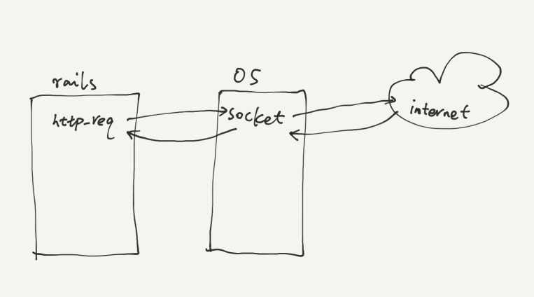
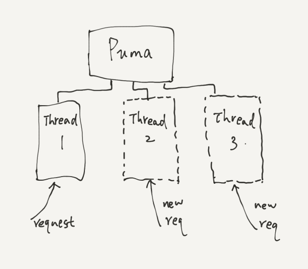
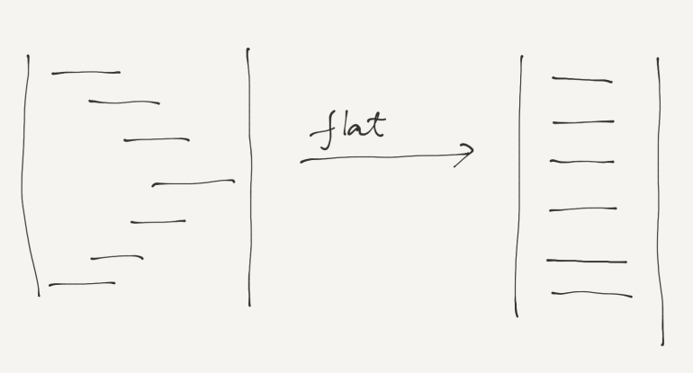
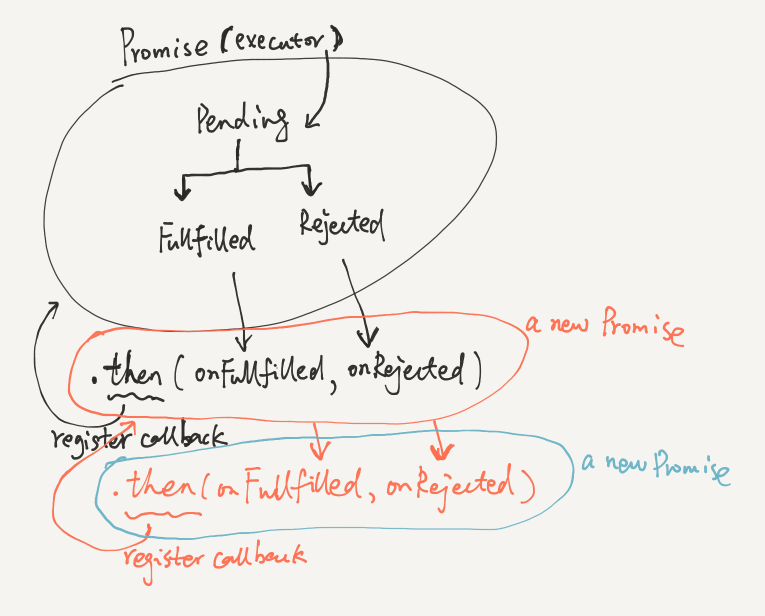

# Modern JavaScript 2

Something new about JavaScript

baurine@2017/09/15

the slides are generated by [Marp](https://github.com/yhatt/marp)

---

# Modern JavaScript 2

- ~~ES6~~
- Promise
- Generator
- Async / Await

Playground: https://jsfiddle.net/

---

Promise / Generator / Await

Have the same goal - resolve **Callback Hell** problem.

---

## So, what's **Callback Hell**?

For example: Podknife project, download a rss xml, check image_url.

	var content = ""
    http.request(
      {url:"https://theonetrueway.podbean.com/feed/"},
      function(res) {
        res.on("data", function(chunk) {
          content += chunk;
        })
        res.on("end", function() {
          rss_parser = new FeedParser(content)
          rss_parser.on('readable', function() {
          	var image_url = this.image_url
            // check whether image_url is ok
            http.request({url: image_ur}, fucntion(res) {
                           // ...
                         }
            )
          })
        })
      }
	) // a callback nest a callback, it is called callback hell
    
---

## Why it doesn't happen in Ruby or other languages?

What it looks like in ruby (ignore error handle):

	def check_image_url
      @xml = Feedjira::Feed.connection(@rss_url).get.body
      // slow, wait until network response back
      @feed = Feedjira::Feed.parse_with 
                Feedjira::Parser::ITunesRSS, @xml
      // slow, wait until parse finish
      @image_valid = RestClient.get(@feed.image_url)
      // slow, wait until network response back
      // ...
      @image_valid
    end

A little silly, but the logic and code are much more natural, elegant, simpler and clearer, and **flat**.

This is called sync call while the Javascript called async call.

---

---

## Sync Call vs Async Call

Sync Call: It likes you send a message to a girl, then you do nothing but just wait her answer/response. Only if she replies, then you continue to send her messages and/or do some other activities.

Async Call: you send a message to a girl, but you don't wait her answer/response, you keep sending messages. At the same time you do other activities such as texting other girls or reading. When the first girl replies, then you come back to handle her message.

---

## Why it won't block other requests

Because Ruby supports multi-thread: when a new request comes, it will create a new thread to handle the new request.

---

## But Javascript just has a single thread

So it has to call all methods that will cost a lot of time asynchronously, else it will block other requests.

It is a kind of smart, and more efficient way, because it doesn't need to waste time in waiting.

But the code is too ugly, how can we flaten them? => Combine the async call and sync call advantages together.

---

---

## Solution

- Promise
- Generator
- Async / Await

Let's take an overview on how their codes look like first.

---

## Promise

    fetch(rss_url)
        .then(res => res.xml())
        .then(xml => new RssParser(xml))
        .then(parser => parser.image_url)
        .then(iamge_url => fetch(image_url))
        .then(res => res.ok)

---

## Generator

	// notice here has a asterisk
    function* check_image_url(rss_url) {
      var res = yield fetch(rss_url)
      var xml = yield res.xml()
      var parser = yield new RssParser(xml)
      var image_url = parser.image_url
      res = yield fetch(image_url)
      return res.ok
    }

    // notice, here has a co() method
    co(check_image_url("http://xxx"))

---

## Async / Await

    async function check_image_url(rss_url) {
      var res = await fetch(rss_url)
      var xml = await res.xml()
      var parser = await new RssParser(xml)
      var image_url = parser.image_url
      res = await fetch(image_url)
      return res.ok
    }
    
    // don't need co() method
    check_image_url("http:/xxx")
    
    
---

## Promise

I think it is really important: it is the base of generator and async / await. It is worth to cost time to understand it.

Resource: [JavaScript Promise 迷你书](http://liubin.org/promises-book/)

"I promise you we will earn much money one day"

- It will happen in the future, not now.
- There will be 2 kinds of result: Success or Failure.

---

---

## Example

    console.log('step1')

    new Promise(function(resolve, reject){
      const ranVal = Math.ceil(Math.random()*100)
      if (ranVal < 50) {
        resolve(ranVal)
      } else {
        reject(ranVal)
      }
    })
    .then(val => console.log('step2 - success:', val), 
          val => console.log('step2 - failed:', val))

    console.log('step3')
    
---

## Example

    function multiply5(val, cnt) {
      const retVal = val * 5
      console.log(`step ${cnt} - ${retVal}`)
      if (retVal > 60) {
        throw new Error('beyond 60')
      }
      return retVal
    }

    Promise.resolve(2)
           .then(val => multiply5(val, 1))
           .then(val => multiply5(val, 2))
           .then(val => multiply5(val, 3))
           .then(val => multiply5(val, 4))
           .catch(err => console.log('err:', err.message))

---

## ~~Generator~~ Iterator

    var langs = ['JavaScript', 'Python', 'C++']

    // example 1
    for (let i=0; i<langs.length; i++) {
      console.log(langs[i])
    }
    
    // example 2
    for (const l of langs) {
      console.log(l)
    }
    
Do you have any questions about the above code?

Why the example 2 can remember where the code ran last time?

---

## Iterator

    function makeIterator(array){
        var nextIndex = 0;
        return {
          next: function(){
              return nextIndex < array.length ?
                  {value: array[nextIndex++], done: false} :
                  {done: true};
          }
        }
    }

    var it = makeIterator(['yo', 'ya']);
    console.log(it.next().value); // 'yo'
    console.log(it.next().value); // 'ya'
    console.log(it.next().done);  // true

---

## yield

Can something help to remember where the code ran last time, and ran from there next time?

Lucky! **yield**

It's totally different from "yield" in Ruby.

- run code, generate result, then stop!
- when you run again the code, it will execute from where last time it stops, and not from beginning.

---

## Example

    function* simpleGenerator(){
      yield "first";
      yield "second";
      yield "third";
      for (var i = 0; i < 3; i++)
        yield i;
    }

    var g = simpleGenerator();   // genrate Generator object
    console.log(g.next().value); // first
    console.log(g.next().value); // second
    console.log(g.next().value); // third
    console.log(g.next().value); // 0
    console.log(g.next().value); // 1
    console.log(g.next().value); // 2
    console.log(g.next().value); // undefined

---

## Generator

Notice:

- always remember, it is not a normal function. When you execute the generator function, it will not run any codes inside it, it just returns an object - Generator object.
- you need to manually call generator object's `next()` method to run the code inside it.
- always return an object like this: `{value: xxx, done: true/false}` after run `next()`

---

## Pass parameters to `next()`

    function *foo(x) {
        var y = 2 * (yield (x + 1));
        var z = yield (y / 3);
        return (x + y + z);
    }

    var it = foo( 5 );
    
Guess what y and z value will be?

Any values, it depends on the parameter it passed to `next()`

    console.log( it.next() );       // { value:6, done:false }
    console.log( it.next( 12 ) );   // { value:8, done:false }
    console.log( it.next( 13 ) );   // { value:42, done:true }

---

## Some real code

How a generator implements async call?

    var myGen = function*() {
      // $.get() return a Promise object
      var one = yield $.get('/api/friends');
      var two = yield $.get('/api/profile');
      var three = yield $.get('/api/tweets');
    }

    function smartCode(generator) {
      // ready to run
      var gen = generator();
      // get first yielded value
      var yieldVal = gen.next().value;
      // check whether yieldedVal is whether a promise
      if (yieldVal.then) {
        // notice the parameter is gen.next, not gen.next()
        yieldVal.then(val => gen.next(val)) 
      }
      ...
    }

---

## Scheduler

What the F***? I still need to write a scheduler for a generator function?

Don't worry, some guys helped you to write it already, you just need to use the following code:

    const co = require('co')

    const URL = 'http://jsonplaceholder.typicode.com/posts/1'

    co(function*() {
      const res = yield fetch(URL)
      const post = yield res.json()
      const title = post.title
      console.log('Title:', title)
    })

Limitation: it must be a promise (or thunk) after yield.

---

## Finally - Async / Await

If you understand the generator, then Async / Await becomes very easy to understand.

One of the Generator drawback is that it need to write scheduler, although some guys helped to implement it, but it has its limitations.

People are not satisfied, so finally Async / Await is invented. It nearly equals to a generator + built-in scheduler.

---

## Example

    const URL = 'https://jsonplaceholder.typicode.com/posts/1'

    async function getTitle() {
      const res = await fetch(URL)
      const post = await res.json()
      console.log('Post:', post)
      const title = post.title
      console.log('Title:', title)
    }

    getTitle()
    console.log("won't block later operations")

---

## Example

    async function getStockPriceByName(name) {
      var symbol = await getStockSymbol(name);
      var stockPrice = await getStockPrice(symbol);
      return stockPrice;
    }

    getStockPriceByName('goog')
      .then(price => console.log(price));