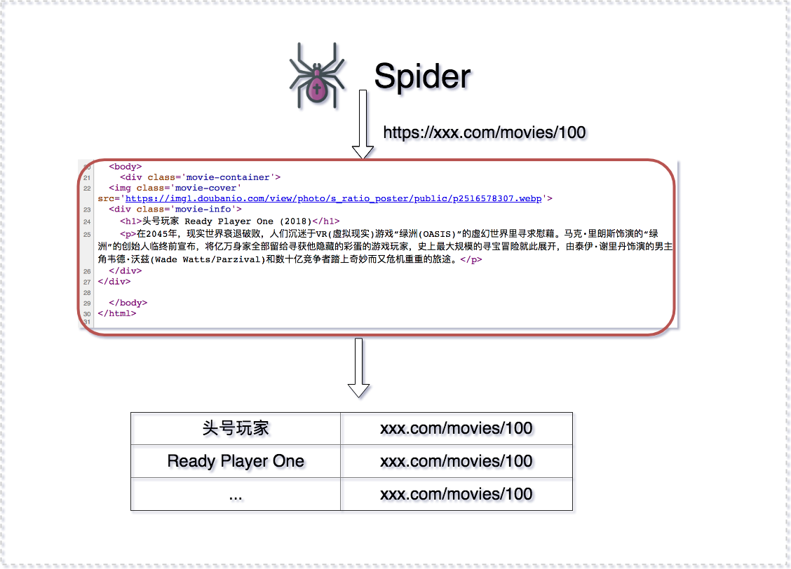
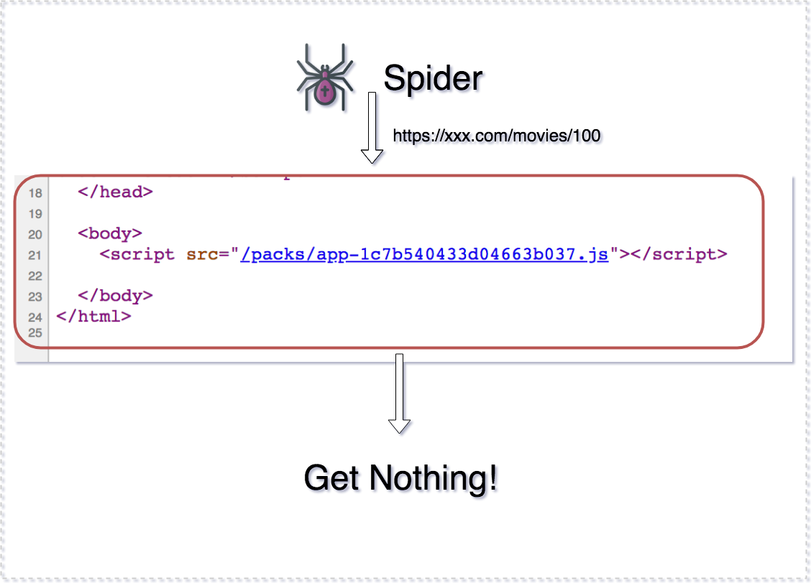

# Practice React in Rails


baurine@2018/04/20

the slides are generated by [Marp](https://github.com/yhatt/marp)

---

## Background

why I want to share this.

---

## Content Table

1. What's CSR (client side rendering) & SSR (server side rendering), comparison
1. What's SEO (search engine optimization), How search engine works
1. CSR's drawbacks (SEO not friendly & blank first screen)
1. Demo webpacker to support use react in rails
   - install webpacker
   - implment SSR / CSR example (MoviesController)
1. Demo use third party npm packages (react-stars)
1. Demo blank first screen and workaround (loading status)
1. Demo react-rails to support SSR for react
1. Summary

---

## CSR & SSR

Demo

- SSR: the HTML contents are mainly generated in server side
- CSR: the HTML contents are mainly generated in client side

---

## SEO

- Search Engine Opitmization
- How search engine works

---



---



---

- Consider SEO sites: content related (blog, news)
- Don't care about SEO sites: can't access by anonymous (admin interface / forum / social (facebook))

---

## CSR's drawbacks

- SEO not friendly
- blank first screen (demo)

---

## Demo webpacker

- Gemfile webpacker
- bin/rails webpacker:install
- bin/rails webpacker:install:react
- implement SSR / CSR examples


```
bin/rails g model Movie cover_img:string title:string desc:text
bin/rails g controller Movies ssr csr
```

---

## Demo use npm package

- react-stars

---

## Demo blank first screen and workaround

---

## Demo react-rails to support SSR for react

- bin/rails g react:install

---

## Summary

webpacker + react-rails, looks cool for rails!

Q & A
