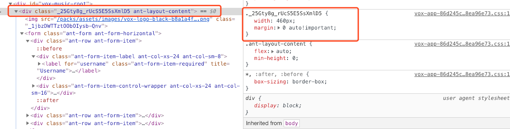
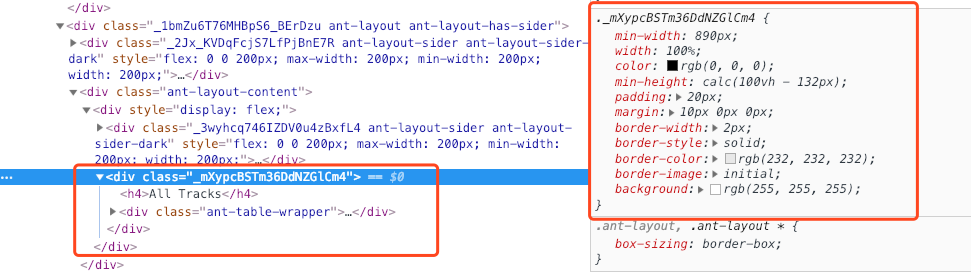
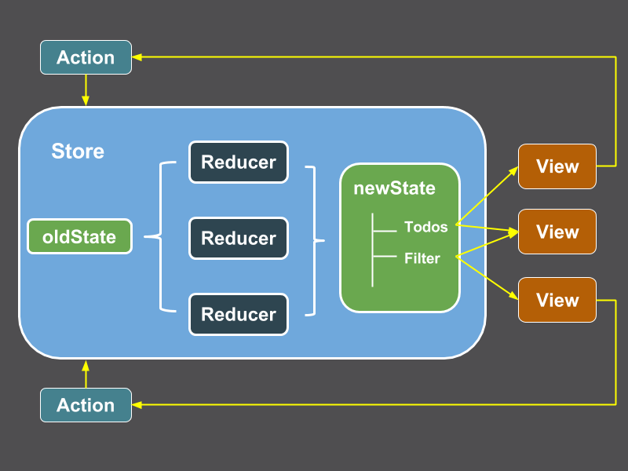

export { yellow as theme } from 'mdx-deck/themes'
import Content from './Content'

# VoxMusic Web App Recap


baurine@2018/12/14

```notes
last time yohann shared the vox music pc application, today I want to share you its web app which built by @andrew and me.

and recap the technologies we used in it, hope can help you in the future projects.

everybody likes music, right, and it is in everywhere, in hotel, cafe, shopping mall.

so the vox music web app is used to help client to control which place, in which time, should play what music.
```

---

# [DEMO](https://vox.develop.ekohe.com/clients/1/locations/1/playlists)


```notes
assume the client has a hotel, so we create a hotel location.

in the hotel, we should have a device to play the music, the device has many channels, each channel play same or different tracks, the different places can listen to different channel.

we create a playlist to include some tracks.

then we create a campaign to control which channel should play which playlist in what time.

that's all, then xiaoming's PC application will fetch these data, download the right tracks, and play it in proper time.
```
---

## The frontend technologies we used in VoxMusic

- SPA, No SSR, No SEO
- Language: [TypeScript](https://www.typescriptlang.org/)
- View Framework: [React](https://reactjs.org/)
- Components: [Ant Design](https://ant.design/index-cn)
- CSS: CSS Modules
- Router: [React Router](https://reacttraining.com/react-router/)
- State Management: [DVA](https://dvajs.com/)
- Bundler: [Webpacker](https://github.com/rails/webpacker)

```notes
mainstream technologies

I will explain them one by one
```

---

# [TypeScript](https://www.typescriptlang.org/)

- Type check in compile time, not runtime, avoid some stuip `undefined` crash in runtime caused by typo
- Code Intelligence
- Convinent Refactor
- Compile to JavaScript
- ...

```notes
TypeScript is the superset of JavaScript, as its name, it brings the type to JavaScript
```

---

# Used in VoxMusic

```ts
// types.ts
export interface IClient {
  id: number
  name: string
  locations: ILocation[]
}

export interface ILocation {
  id: number
  name: string
  client_id: number
}
```

```notes
most of these types are same or similiar with your API JSON response

we use interface to define the type.
```

---

```tsx
// LocationForm.tsx
type Props = {
  location: ILocation

  onUpdate: (location: ILocation) => void
  onDelete: (location: ILocation) => void

  dispatch: any
}

type State = ILocation
```

```notes
we also can use `type` keyword to define some types
```

---

```tsx
// LocationForm.tsx
class LocationForm extends React.Component<Props, State> {
  constructor(props: Props) {
    super(props)
    this.state = this.driveState(props.location)
  }

  ...

  render() {
    const { location } = this.props
    const { name } = this.state
    return (
      <Form onSubmit={this.handleSubmit}>
        <h2>
          { location.name }
        </h2>
        ...
  }
}
```

---

# DEMO

---

# React

- Layout Component

```notes
no much to say, just want to talk about the Layout component.

just from vox music, I start to use Layout component, then I realize I wrote many duplicated codes in Podknife and koba projects, so I came back to refactor them by Layout component.
```

---

## Server Side Layout

```html
# application.html.erb
<!DOCTYPE html>
<html>
  <head>
    <title>Title</title>
    ...
    <%= javascript_include_tag 'application' %>
    <%= stylesheet_pack_tag    'application' %>
  </head>

  <body>
    <%= render 'shared/navbar' %>
    <%= yield %>
  </body>
</html>
```

```notes
so what's the layout component. in server side, we have a top layer layout file, called application.html.erb, right? this file contains the all the elements each page should have, right?

for example, here we `render 'shared/navbar'` int the body top, so every page will have the navbar in the top of the page, right?

so each page can focus on the its specialized content. the layout use `yield` to generate the different page content.
```

---

## Client Side Layout

```tsx
// MainLayout.tsx
export default (props: any) =>
  <div>
    <Header className={styles.header}>
      <NavHeader/>
    </Header>
    <div className={styles.layout}>
      <Sider className={styles.sider}>
        <SiderMenu {...props} />
      </Sider>
      <Content>
        { props.children }
      </Content>
    </div>
  </div>
```

```notes
just same as the application.html.erb, we can define a layout component will contains the components each page should have, for example, each page should have NavHeader, SiderMenu, so we put them in the layout component, we use `{ props.children }` to present the each page specialized content.
```

---

```tsx
// DevicesPage.tsx
import MainLayout from '../../layouts/MainLayout'

class DevicesPage extends React.Component<any, {}> {
  ...
  render() {
    return (
      <MainLayout>
        <div style={{display: 'flex'}}>
          { this.renderDevices() }
          ...
        </div>
      </MainLayout>
    )
  }
}
```

```notes
so each page should make the MainLayout as its conatiner, and focus on implementing its specialized content.
```

---

# [Ant Design](https://ant.design/index-cn)


- Out of Box React Components
- Build Admin Pages
- [AntDesign Pro](https://preview.pro.ant.design/dashboard/analysis)

```notes
as you see in the former demo, all components in the vox are picked from ant design, sider menu, button, table, breadcrumb, modal, form ... very convinent
```

---

# DEMO

```notes
skip
```

---

# CSS Modules

- CSS class is global (global variable is not recommened in other languages)
- Naming is hard, not easy to use same class name in different components

A solution:

- BEM `.block--element__modifier`

```notes
until now, I think css is the most difficult thing for me.

it is really hard to avoid the conflicts between css classes.

because the css is global, you must be carefully not override other styles.
```

---

<Content>
CSS Modules, as its name, modules, make CSS class just takes effect inside a module.
</Content>

<Content>
The secret is it will convert the class name to some hash string to make it unique to avoid the conflicts.
</Content>

---

```css
/* LoginPage.module.css */
.container {
  width: 460px;
  margin: 0 auto !important;
}
```

```tsx
// LoginPage.tsx
const styles = require('./LoginPage.module')
// import styles from './LoginPage.module'
  ...
  render() {
    return (
      <Content className={styles.container}>
        
        { this.renderForm() }
      </Content>
    )
  }
```

---

```css
/* style.module.css */
.container {
  min-width: 890px;
  width: 100%;
  padding: 20px;
  margin: 10px 0 0 0;
  ...
}
```

```tsx
// TracksPage.tsx
const styles = require('../style.module')
  ...
  render() {
    const { tracks } = this.props
    return (
      <div className={styles.container}>
        <h4>All Tracks</h4>
        <TrackList tracks={tracks}/>
      </div>
    )
  }
```

---





---

## Limitation

- Only convert the css class, won't convert tag, id

More choices:

- [styled-component](https://www.styled-components.com/)
- [Emotion](https://emotion.sh/)
- ...

---

# Router: [React Router](https://reacttraining.com/react-router/)

- SPA, handle all routes in client side instead of server side

---

## Server Side

- Should return same content for all requests (except the API)

```ruby
# routes.rb
# client side will take over the all remain routers
root 'home#index'
get '*path', to: 'home#index', constraints: lambda { |req|
  req.path.exclude? 'rails/active_storage'
}
```

---

## Client Side

```tsx
// routes.tsx
export default ({ history } : { history : any}) =>
  <Router history={history}>
    <Switch>
      <Redirect exact from='/' to='/clients'/>
      <Route path='/login' component={LoginPage}/>

      <Route exact path='/clients' component={ClientsPage}/>
      <Route path='/clients/:clientId/locations' component={LocationsPage}/>

      <Route exact path='/devices' component={DevicesPage}/>
      <Route path='/devices/:deviceId' component={DevicesPage}/>

      <Route path='/playlists' component={PlaylistsPage}/>
      <Route path='/tracks' component={PlaylistsPage}/>

      <Route path='/campaigns/conflicts' component={CampaignsConflictsPage}/>

      <Route component={NotFoundPage}/>
    </Switch>
  </Router>
```

---

# State Management: [DVA](https://dvajs.com/)

- Wrap redux, redux-saga, react-router
- Put effects (async operations) and reducers (sync operations) together inside one file and one object named model

```notes
most the difficult part, won't dive into it, just a glance/glimpse.
```

---



- reducers just can handle sync actions
- middleware to handle async operations: redux-thunk, redux-saga

```notes
let recap this graph I shared before, how redux works with react.
```

---

## Compare

- Original redux with redux-thunk (used in BI project)

Define action types

```js
// action_types.js
export const FETCH_SW_PLANET_START = 'fetch_sw_planet_start'
export const FETCH_SW_PLANET_SUCCESS = 'fetch_sw_planet_success'
export const FETCH_SW_PLANET_FAILED = 'fetch_sw_planet_failed'
```

```notes
each action should have unique action type.
```

---

Define API

```js
// services/api.js
export function fetchPlanet(planetId) {
  return fetch(`https://swapi.co/api/planets/${planetId}`)
         .then(parseResponse) // will talk it later
         .then(data => ({ data }))
         .catch(err => ({ err }))
}
```

---

Define actions

```js
// actions/planets.js
export function queryPlanet(planetId) {
  return (dispatch, getState) => {
    dispatch({ type: FETCH_SW_PLANET_START })
    fetchPlanet(planetId)
      .then(res => {
        if (res.data) {
          dispatch({ type: FETCH_SW_PLANET_SUCCESS, payload: { data, planetId }})
        } else {
          dispatch({ type: FETCH_SW_PLANET_FAILED, payload: { err, planetId }})
        }
      })
  }
}
```

---

Define reducers

```js
// reducers/planets.js
export function planets(state = {}, action) {
  switch (action.type) {
    case FETCH_SW_PLANET_START:
      return {
        ...state,
        loading: true
      }
    case FETCH_SW_PLANET_SUCCESS:
      const { data, planetId } = action.payload
      return {
        ...state,
        loading: false
        [planetId]: data
      }
    case FETCH_SW_PLANET_FAILED:
      return {
        ...state,
        loading: false
      }
    default:
      break;
  }
}
```

---

View

```js
// pages/PlanetDetailPage.js
class PlanetDetailPage extends React.Component {
  componentDidMount() {
    this.props.fetchPlanet(this.props.planetId)
  }
  ...
  render() {
    const planet = this.props.planets[this.props.planetId]
    if (planet) {
      return (
        <h1>{planet.name}</h1>
        ...
      )
    }
  }
}
```

---

Connect View with Store

```js
// pages/PlanetDetailPage.js
function mapStateToProps(state) {
  return {
    planets: state.planets
  }
}
function mapDispatchToProps(dispatch) {
  return {
    fetchPlanet: (planetId) => dispatch(queryPlanet(planetId))
  }
}
export default connect(mapStateToProps, mapDispatchToProps)(PlanetDetailPage)
```

---

## DVA

```js
// models/planets.js
export default {
  namespace: 'planets',
  state: {},
  effects: {
    *queryPlanet: ({ payload }, { call, put }) {
      const { planetId } = payload
      const res = yield call(fetchPlanet, planetId)
      if (res.data) {
        yield put({
          type: 'savePlanet',
          payload: {
            planetId,
            planet: res.data
          }
        })
      }
    }
  },
  ...
  reducers: {
    savePlanet: (state, { payload }) {
      const { planetId, planet } = payload
      return {
        ...state,
        [planetId]: planet
      }
    }
  }
}
```

```notes
you don't need to define the action types, because the method name is the action type.
```

---

View: Same

Connect View with Store

```js
function mapDispatchToProps(dispatch) {
  return {
    // fetchPlanet: (planetId) => dispatch(queryPlanet(planetId))
    fetchPlanet: (planetId) => dispatch({
      type: 'planets/queryPlanet',
      payload: { planetId }
    })
  }
}
```

```notes
dispatch a plain object instead of a function
```

---

# Bundler: [Webpacker](https://github.com/rails/webpacker)

- Support to use npm packages by `npm install` or `yarn add`
- Bundle all javascript code to application.js
- Bundle all css files to application.css
- Bundle assets to assets folder

<Content>
all codes are in `app/javascript/` instead of `app/assets/javascripts`
</Content>

---

## Server Side

```haml
# application.html.haml
    = stylesheet_link_tag    'application', media: 'all', 'data-turbolinks-track': 'reload'
    = javascript_include_tag 'application', 'data-turbolinks-track': 'reload'
    = stylesheet_pack_tag 'application'
    = javascript_pack_tag 'application'
```

---

# More

- Folder Structure
- Wrap API Request

---

## Folder Structure

```
- assets
  - images
- packs
  - vox-app.ts
  - routes.tsx
- layouts
  - MainLayout.tsx
  - MainLayout.module.scss
- pages
  - LoginPage.tsx
  - LoginPage.module.scss
- components
  - LoginForm.tsx
  - LoginForm.module.scss
- styles
  - global.scss
- models
  - clients.ts
  - playlists.ts
- services
  - api.js
- utils
  - date-time.ts
  - request.ts
- types.ts
```

---

## Wrap API Request

request.ts

```ts
export default function request(url: string, method?: 'GET'|'POST'|'PUT'|'DELETE', body?: object, options?: RequestInit) {
  const opts: RequestInit = {
    ...options,
    method: method || 'GET',
    headers: {
      'Accept': 'application/json',
      'Content-Type': 'application/json',
      'Authorization': getAccessToken()
    }
  }
  if (body) {
    opts.body = JSON.stringify(body)
  }
  return doFetch(url, opts)
}
```

---

```ts
function doFetch(url: string, options: RequestInit) {
  return fetch(url, options)
    .then(parseResponse)
    .then(data => ({ data }))
    .catch(err => ({ err }))
}
```

---

```ts
function parseResponse(response: Response) {
  if (response.status === 204) {
    return {}
  } else if (response.status >= 200 && response.status < 300) {
    return response.json()
  } else {
    return response.json().then((resData: any)=> {
      const errMsg = resData.msg || response.statusText
      message.error(errMsg)

      if (response.status === 401) {
        history.push('/login')
      }
      const error: ResError = new Error(errMsg)
      error.response = response
      throw error
    })
  }
}
```

---

Request API by `request()`

```ts
export function queryClients() {
  return request(fullUrl('clients'))
}

export function createClient() {
  const body = {
    client: {
      name: ''
    }
  }
  return request(fullUrl(`clients`), 'POST', body)
}

export function updateClient(client: IClient) {
  const body = {
    client
  }
  return request(fullUrl(`clients/${client.id}`), 'PUT', body)
}

export function deleteClient(clientId: number) {
  return request(fullUrl(`clients/${clientId}`), 'DELETE')
}
```

---

# Thanks!

# Q & A
