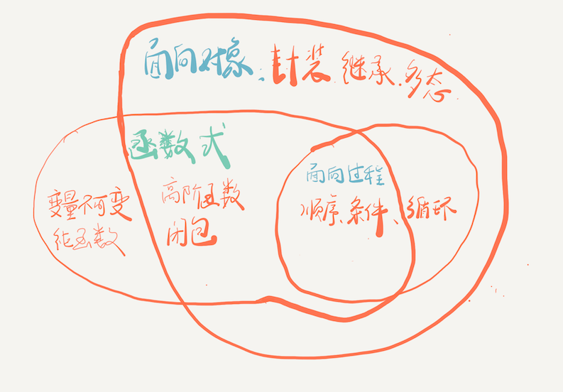

# Workshops

- structured / object-oriented / functional programming (面向过程 / 面向对象 / 函数式编程)
- React 1/2

## 面向过程 / 面向对象 / 函数式编程

三者不是完全割裂对立的，面对对象，对象的每个方法，还是用面向过程来实现，函数式编程的很多特点已经融合到面向对象中了

先从一个经典的哲学问题开始：把大象装进冰箱分几步。

- 面向过程：代表语言 - C，但大部分语言都可以拿来写面向过程的代码
- 面向对象：现在新式语言 C++ Java C#  Swift (强类型) | Ruby Python JavaScript (弱类型) 当然，你也可以拿它们写面向过程，实际，很多人就是拿着面向对象的语言，写着面向过程的代码

PHP，最先学 C，然后学 Java；Javascript 也是，即可以用面向过程来写，也可以用面向对象来写

函数式：基本数学公式，Lisp / Erlang / Elixir，优势，分布式

面向对象三大特点：封装，继承，多态

一定要举个例子，不然太抽象了，讲的例子，练习的例子

- 面向对象 - 思考怎么划分成一个个对象
- 面向过程 - 思考怎么一步步来解决这个问题

- 面向对象 - 数据和行为是封装在一个类中
- 面向过程 - 数据和形为是分离的

https://www.zhihu.com/question/27468564/answer/227475980

http://mapanalee.github.io/post/%E9%9D%A2%E5%90%91%E8%BF%87%E7%A8%8B%E5%92%8C%E9%9D%A2%E5%90%91%E5%AF%B9%E8%B1%A1/

例子：把大象装进冰箱，分几步。装进两个冰箱，装进洗衣机。

作业：打印机，打印一段文本，加上页眉页脚，50个字为一页，10个字为一行。打印机，不同字号，颜色，字体，一行多少个字，多少行。先用面向过程，再用面向对象。

面向过程：直观，一步一步解决问题，缺点：复用性太差，扩展性差

特点：数据和行为是分离的，需要知道细节

面向对象：

最主要的特点：数据和行为封装在一起，提高了复用性

封装、继承、多态

继承：person, man, woman

多态：动物叫。强类型语言，针对弱类型语言，我们称之为鸭子模型

函数式：

1. 变量不可变 / 没有循环，用递规实现
1. 纯函数，不能有副作用 Date() 不是  y=f(x)
1. 函数是一等公民
1. 高阶函数
1. 纯粹的函数式语言  没有类、对象 (why? 因为对象内部存储可变的状态)
1. 高阶函数，被现代面向对象语言所吸收
1. 闭包
1. 天然优势：分布式

作业：

- 面向过程实现：http://jsbin.com/soyilibelu/10/edit?js,output
- 面向对象实现：http://jsbin.com/vebimufubo/1/edit?js,console,output

## React 101

目标：对它有感觉，初步了解，能写出一个简单的 component

React, a MVVM framework

React / Vue / Angular

MVVM

Model <-- ViewModel --> View/DOM

y = f(x)

View = f(Model)

Model —> View

TodoList

Playground: jsbin, CodeSanbox

Component，实际是函数或类，Data —> View

props properties

View = f(Model)

props / state

如果只有 props，可以简写成函数

如果有内部的 state，则要写成类

TodoList 有内部的 state

所有 html 的 element 都由 react 渲染出来，所以 html 代码几乎为 0

示例：

Props: Hello

Counter: Counter

JSX 语法

this.setState()

要怎么来修改内部 state 呢，用 setState 方法

作业: Counter 可以有一个任意值的起始值

视情况，要不要继续进一步讲 TodoList 的实现
